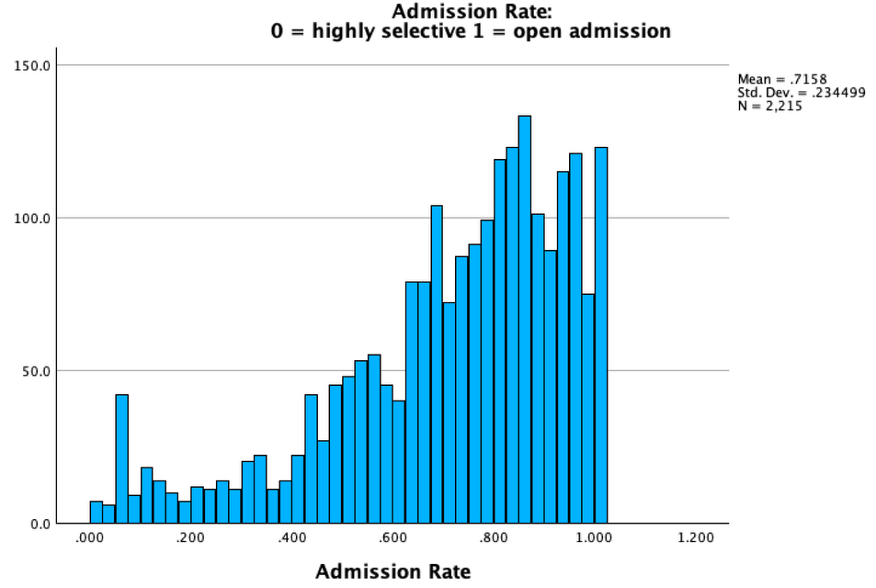
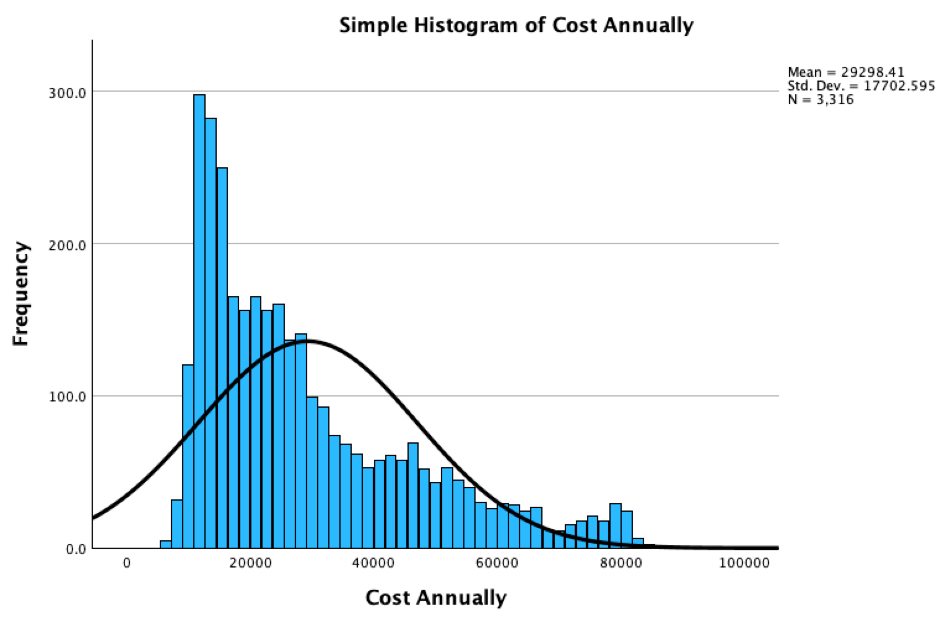
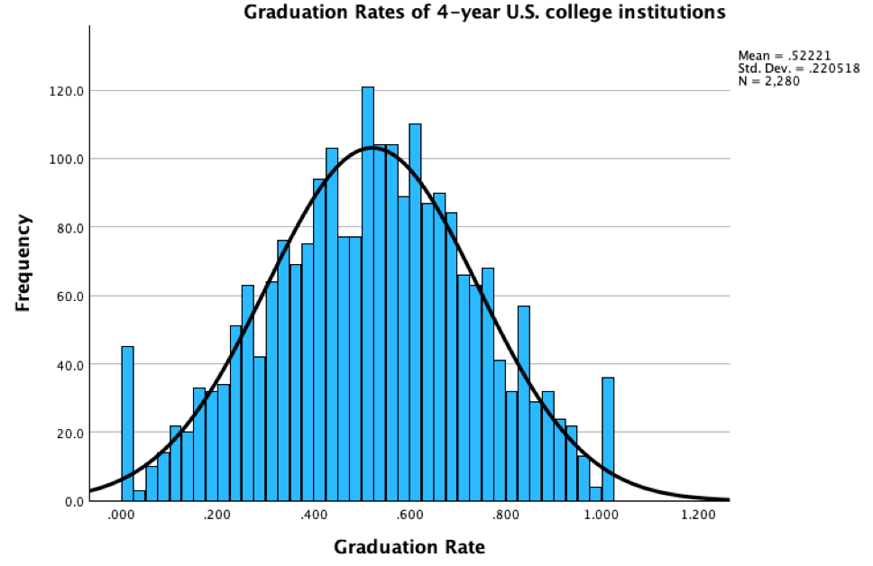
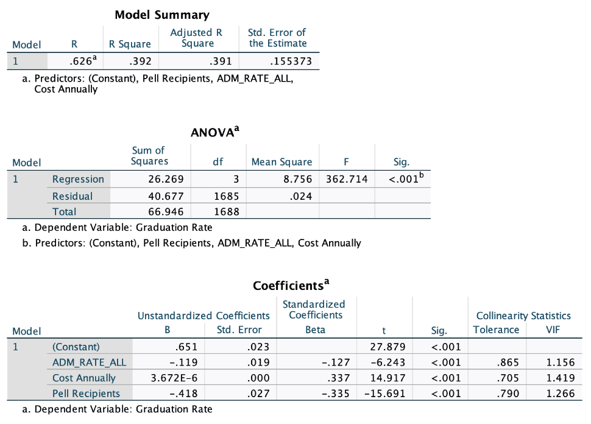

# College Graduation Rate Analysis
SPSS analysis examining how admission rates, cost of attendance, and Pell Grant participation relate to graduation rates at U.S. four-year colleges.
---

## 📊 Project Overview

This project examines factors that may help explain differences in **graduation rates among four-year U.S. colleges**. Using data from the U.S. Department of Education, the analysis focused on three factors: admission rate, cost of attendance, and the percentage of students receiving Pell Grants.

The dataset was prepared and analyzed using **IBM SPSS Statistics**. Descriptive statistics and data visualizations were first used to explore the distributions and characteristics of each variable. A multiple linear regression model was then developed to determine how the three factors were related to graduation rates.

The final model found that **admission rate, cost of attendance, and Pell Grant percentage were all statistically significant predictors of graduation rate** within the dataset. The analysis provided an opportunity to move from data preparation and exploratory analysis through statistical modeling and interpretation of the results.

---

## 🎯 Research Question & Objectives

The analysis was designed around the following research question:

**How do admission rate, cost of attendance, and the percentage of Pell Grant recipients relate to graduation rates at four-year U.S. colleges?**

To address this question, the project focused on the following objectives:

- Examine the distribution and characteristics of **admission rates, cost of attendance, Pell Grant participation, and graduation rates**.
- Evaluate the relationship between each of the three predictor variables and college graduation rates.
- Develop a **multiple linear regression model** to determine whether admission rate, cost of attendance, and Pell Grant percentage significantly predict graduation rates.
- Interpret the statistical results to identify which factors have the strongest relationships with graduation rates.

---

## 🗂️ Data Source & Preparation

The dataset used for this project was obtained from the **U.S. Department of Education** and included information collected from sources such as IPEDS, the National Student Loan Data System (NSLDS), FAFSA, and the U.S. Department of the Treasury and IRS.

The original dataset contained thousands of variables, so the data was filtered to focus on the information needed for this analysis. Four primary variables were selected:

- **Graduation Rate** – the dependent variable used as the outcome of the analysis.
- **Admission Rate** – the percentage of applicants admitted by each institution.
- **Cost of Attendance** – the annual cost for a full-time undergraduate student.
- **Pell Grant Percentage** – the percentage of undergraduate students receiving Pell Grant assistance.

During the initial analysis, admission policy was treated as a categorical variable representing open or selective admission. This approach produced results that were difficult to interpret, so the variable selection was revised to use the continuous admission-rate measure (ADM_RATE_ALL). This provided a more useful way to compare admission rates across institutions and was used in the final analysis.

After selecting the appropriate variables, descriptive statistics and visualizations were used to examine the data before developing the multiple linear regression model.

---

## 📈 Exploratory Data Analysis

Descriptive statistics and visualizations were used to better understand the distribution of the variables before developing the regression model. This step helped identify the overall characteristics of the institutions in the dataset and provided context for interpreting the final analysis.

### Admission Rate Distribution

The average admission rate among institutions in the dataset was approximately **71.6%**. Most colleges admitted a relatively high percentage of applicants, while fewer institutions had highly selective admission policies.



The distribution shows that a large portion of the institutions admitted between approximately 70% and 100% of applicants. This suggests that highly selective colleges represented a smaller portion of the institutions included in the analysis.

### Cost of Attendance Distribution

The average annual cost of attendance was approximately **$29,298**, with costs ranging from about $5,500 to nearly $87,000.



Most institutions were concentrated within the lower and middle cost ranges, while a smaller number of colleges had significantly higher annual costs. These higher-cost institutions created the long tail visible in the distribution.

### Graduation Rate Distribution

The average graduation rate among institutions in the dataset was approximately **52%**, meaning that just over half of first-time, full-time students completed their bachelor's degree within six years.



Most institutions had graduation rates concentrated within the middle portion of the distribution, while fewer colleges appeared at the very low or very high ends. Examining this distribution was especially important because graduation rate served as the dependent variable in the regression analysis.

---

## 📉 Multiple Linear Regression

A multiple linear regression model was used to determine whether **admission rate, cost of attendance, and Pell Grant percentage** could significantly predict graduation rates among four-year U.S. colleges.

The overall regression model was **statistically significant (F = 362.71, p < .001)** and explained approximately **39.2% of the variation in graduation rates (R² = .392)**. All three predictor variables were statistically significant within the model.



### Model Results

- **Admission Rate (β = -0.13):** Admission rate had a negative relationship with graduation rate. Institutions with lower admission rates, indicating greater selectivity, tended to have higher graduation rates.
- **Cost of Attendance (β = 0.34):** Cost of attendance had a positive relationship with graduation rate, with higher-cost institutions tending to have higher graduation rates.
- **Pell Grant Percentage (β = -0.34):** Pell Grant participation had a negative relationship with graduation rate. Institutions with a higher percentage of students receiving Pell Grants tended to have lower graduation rates.

The results show that graduation rates are related to multiple institutional and student factors rather than a single characteristic. While the model explained a meaningful portion of the differences in graduation rates, approximately **60.8% of the variation remained unexplained**, suggesting that additional factors outside of this analysis also contribute to college completion rates.

---

## 🔍 Key Findings

The analysis identified several meaningful relationships between institutional characteristics and graduation rates. While these results do not establish cause and effect, they highlight important differences among the four-year colleges included in the dataset.

- **College selectivity was associated with graduation rates.** Institutions with lower admission rates tended to have higher graduation rates, with admission rate showing a negative relationship with graduation rate (β = -0.13).

- **Higher-cost institutions tended to have higher graduation rates.** Cost of attendance showed a positive relationship with graduation rate (β = 0.34), although cost alone should not be interpreted as causing higher completion rates.

- **Pell Grant participation showed a negative relationship with graduation rates.** Institutions serving a higher percentage of Pell Grant recipients tended to have lower graduation rates (β = -0.34), highlighting a potential relationship between student financial need and college completion.

---

## 🛠️ Tools & Skills Demonstrated

- **IBM SPSS Statistics** – Data preparation, descriptive statistics, visualization, and statistical modeling
- **Multiple Linear Regression** – Model development, evaluation, and interpretation of predictor relationships
- **Exploratory Data Analysis** – Examined distributions and descriptive statistics before developing the regression model
- **Data Cleaning & Variable Selection** – Filtered a large dataset and revised variable selection when the initial approach produced difficult-to-interpret results
- **Statistical Interpretation** – Evaluated statistical significance, regression coefficients, and model fit
- **Data Communication** – Translated statistical output into clear findings and conclusions  

---

## 📁 Repository Structure

```text
college_graduation_rate_analysis/
│
├── images/
│   ├── admission_rate_distribution.png
│   ├── cost_attendance_distribution.png
│   ├── graduation_rate_distribution.png
│   └── multiple_regression_results.png
│
├── report/
│   └── College_Graduation_Rate_Analysis.pdf
│
├── syntax/
│   └── SPSS_Syntax.png
│
└── README.md


